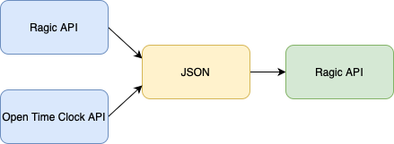

# Merge

Automate Open Time Clock time tracking reports with Python.

## Quickstart Guide

1. Store API credentials in `.env`

2. [Install poetry][1]

3. Install dependencies with `poetry install`

4. Run the script with `poetry run weekly`

[1]: https://python-poetry.org/docs/#installation
